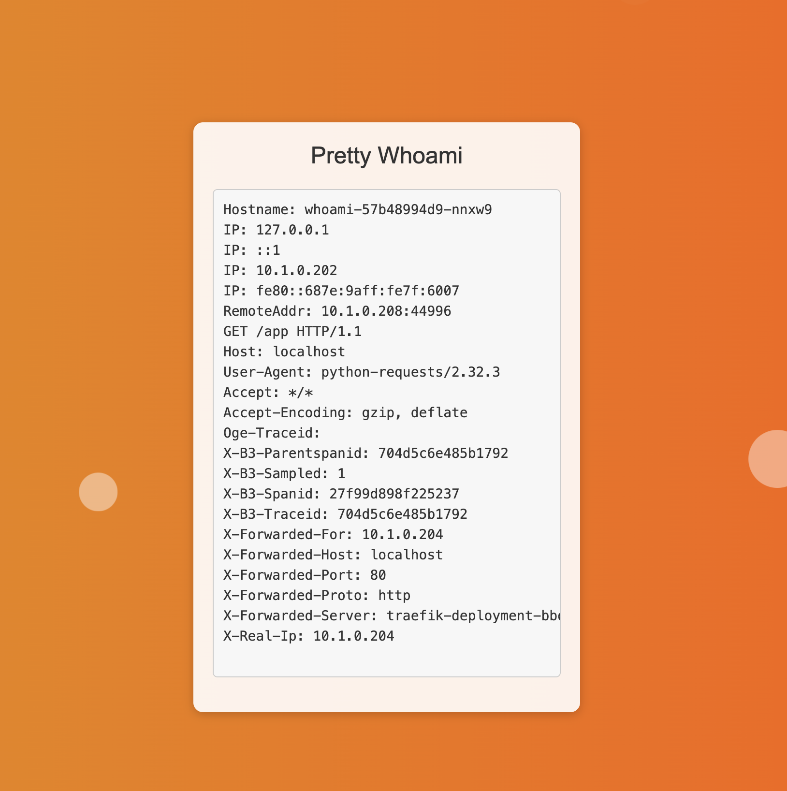

# Pretty Whoami

This application is a simple Flask app that captures and displays the response from the Traefik whoami application. It provides a clean and styled interface to showcase the headers and information returned by the specified whoami service.



## Docker Image

You can pull the pre-built [Docker image](https://hub.docker.com/r/ogechibogu/pretty-whoami) from Docker Hub:


## Running the Application

### Using Docker

The app requires a command-line argument specifying the URL of the whoami service.

### Run the Docker Container

Run the container and provide the `--whoami_url` argument:

```bash
docker run -p 80:80 ogechibogu/pretty-whoami --whoami_url=http://host.docker.internal:8080
```

Replace `http://host.docker.internal:8080` with the actual URL of your whoami service. If the service is running in a Docker container, use `host.docker.internal` to reference your host machine.

## Example Usage

To use the Traefik whoami service:

```bash
docker run -p 80:80 ogechibogu/pretty-whoami --whoami_url=http://host.docker.internal:30008
```

This command assumes that the Traefik whoami service is running on port `30008` on your host machine.

## Notes

- Make sure the specified whoami service is running and accessible from the container.
- The application will display the response in a styled format.